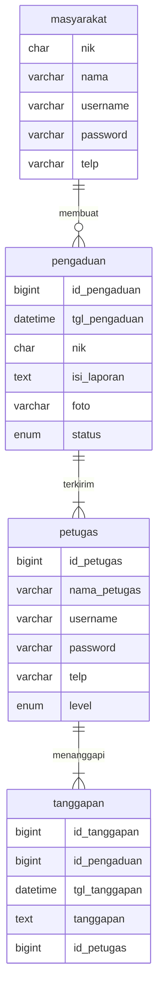
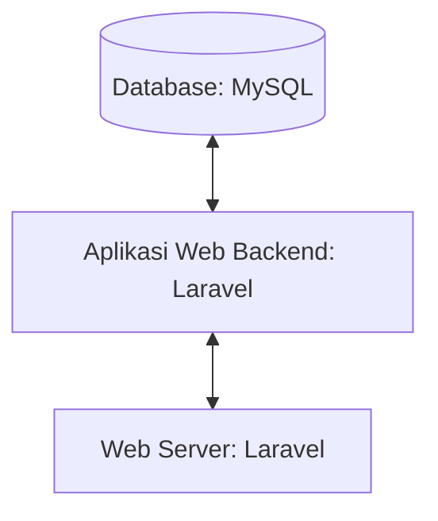

# 1.1 Latar Belakang
saya kan rumah lumayan di pegunungan saat saya mau ke kiara payung lewat ke jalan pegunungan saya mulai berangkat dari rumah, dari rumah menuju ke kiara payung lancar lancar aja pas saya mulai dekat ke kiara payung saya menemukan jalan yang cukup jelek padahal di jalan sebelumnya bagus sedangkan jalan yang dekat ke pegunungan jelek kaya gak ke cek padahal ini emang jalan udah lama jelek jalannya masih belum ada perbaikan dari desa sebenarnya ide nya udah lama dari smk kalo saya bikin website yang dimana masyarakat bisa mengadukan apapun yang ada di daerah mereka mau itu jalan rusak, kalo di daerah saya suka banyak yang membuang sampah sembarangan sehingga sampah ke jalan mengganggu pemotor atau terjadi penumpukan sampah di derah tersebut dan tidak di angkut angkut sampah nya sehingga menyebabkan bau yang mengganggu warga sekitar, dengan pembuatan aplikasi ini masyarakat bisa mengadukan keluhan atau keluhan yang ada di daerah tersebut sehingga lebih efektif dari pihak desa tersebut seperti di daerah tersebut gak ke cek atau gak tahu sehingga agar bisa ditindaklanjuti lebih cepat.
# 1.2 Deskripsi
Untuk pembuatan aplikasi ini saya menggunakan beberapa teknologi yang pernah saya coba sehingga memudahkan saya untuk membuat aplikasi tersebut diantaranya: 
- 1.2.1 MySQL 
   - Menurut pemahaman saya mysql adalah database yang dimana untuk menyimpan sebuah data dari aplikasi, mau aplikasi android maupun web. myqsl ini gratis kalau yang umum download xampp di xampp itu udah include sama mysql nya jadi tinggal di run apache sama mysql, cuman kan saya waktu pakai xampp si apache nya eror terus dari smk sampai masuk kuliah eror terus udah instal ulang windows tetep eror diluar nalar itu, terus ada namanya laragon, kalau laragon hampir sama kaya xampp cuman database nya belum ada atau mysql nya belum ada sehingga harus download dulu si databse nya namanya phpmyadmin jadi pas sudah download phpmyadmin kita setting sedikit di file laragon nya, sebenarnya sama sama aja cuman saya cukup menyesal download xampp jadi di windows gak bisa dipake lagi buat bikin aplikasi karena port 80 nya eror terus da saya juga udah ngulik sampai nanya ke yang udah expert tetep gak bisa jadi laptop saya terpaksa pakai dual OS yaitu linux ubuntu
- 1.2.2 Laravel Dan Bootstrap
    - Laravel adalah sebuah framework bahasa pemrograman php yang dimana si library atau si folder folder nya sudah disiapkan oleh laravel tersebut sehingga tidak membuat folder manual dan lebih efektif, Sedangkan bootstrap itu seperti css buat memperbagus tampilan dan di dalam bootsrap juga ada javascript seperti modal dan bootstrap ini ada yang online ada juga yang offline, kalau online kita tinggal salin link bootsrap nya sama link javascript nya yang ada di web getbootstrap.com sehingga jika kita gak menyalakan internet maka bootstrap nya tidak berjalan sedangkan offline kita mendownload dulu bootstrap nya terus kita pindahkan ke folder si laravel tersebut
- 1.2.3 Figma
    - Figma adalah sebuah aplikasi yang dimana kita bisa membuat desain ux/ux untuk sebuah aplikasi atau pun perancangan dan yang lain nya, figma juga menyiapkan yang namanya community untuk sebagai referensi untuk membuat sebuah desain
- 1.2.4 Visual Studio Code
   - Visual studio code adalah sebuah aplikasi adalah sebuah software editor code yang dimana kita bisa membuat program di visul studio code tersebutdan bisa diinstal di berbagai desktop
- 1.2.5 Linux
  - Linux adalah sebuah OS open source yang cocok untuk programmer, kenapa saya pake linux untuk tugas pengenalan informatika ini, karena OS windows saya dikarenakan si port 80 nya eror terus jadi saya terpaksa membagi 2 penyimpanan yang 1 ke windows dan yang 1 lagi untuk linux
# 1.3 Branding
- merk : SMDC (Sahabat Masyarakat Desa Cileunyi)
- Tagline : "ada masalah di desa anda? laporkan saja disini"
- campaign : Tempat untuk menyimpan keluhan atau saran dan inspirasi untuk kemajuan desa tersebut
- Target user :
   - umur 15+
   - orang yang ingin melaporkan masalah atau pengaduan terkait dengan layanan publik, keamanan, lingkungan, atau masalah lainnya.
- User experience theme:
   - sederhana
   - warna : dominan warna biru tua dan warna putih
   - Inspirasi Design :
   - 
   - 

# 2. User Story

sebagai | saya ingin bisa | sehingga | prioritas
---|---|---|---
masyarakat | membuat laporan pengaduan | bisa kejadian/keadaan di desanya | ⭐⭐⭐⭐⭐
administrator | membuat akun petugas | bisa menanggapi pengaduan dari masyarakat | ⭐⭐⭐⭐⭐
petugas | menaggapi laporan pengaduan | bbisa ditindaklanjuti laporan tersebut | ⭐⭐⭐⭐⭐
masyarakat | melihat laporan yang saya buat | bisa mengingat laporan yang saya buat | ⭐⭐⭐⭐
masyarakat | melihat laporan akun yang lain | bisa melihat pengaduan lainnya | ⭐⭐⭐⭐
administrator | mencetak laporan masyarakat | bisa menyimpan pengaudan masyarakat dalam bentuk fisik | ⭐⭐⭐⭐
administrator | menlihat detail msyarakat | bisa melihat detail identitas masyarakat dan pengaduan laporan nya | ⭐⭐⭐
# 3. Struktur Data

## 4 Arsitektur Sistem

# 5. Teknologi, Library, dan Framework

Untuk teknologi saya menggunakan Visual Studio Code Sedangkan dalam pemrograman saya menggunakan Framework Laravel
# 6. Desain User Experience dan User Interface

## Design UI & UX Menggunakan Figma
### Link Figma
> https://www.figma.com/file/yq2L28KRVuFQePBRRs0U4i/pekat?type=design&node-id=0%3A1&mode=design&t=HHtm69bUVSGFYLqu-1
- **Landing Page**
- 

- **Halaman Login Petugas**
- 

- ** Halaman Daftar**
- 

## 7. Demonstrasi Video

https://youtu.be/7x1lrNfr8CMhttps://youtu.be/7x1lrNfr8CM

## 8. Bagaimana mesin komputasi dan sistem operasi berperan dalam produk teknologi informasimu ?

https://youtu.be/fzXJZ3h-l2Y

## 9. Bagaimana algoritma, struktur data, dan bahasa pemrograman berperan dalam produk teknologi informasimu ?

Link youtube nya di detik jawaban ini

## 10. Bagaimana metode pengembangan perangkat lunak / Software Development Life Cycle berperan dalam produk teknologi informasimu ?

Link youtube nya di detik jawaban ini
Proses Pembangunan Teknologi Informasi secara umum mengikuti Web Development Life Cycle :

   - Analysis

     Analisis adalah tahapan ketika kita mencoba menganalisa website seperti apa akan dibuat

   -	Design

    	Setelah itu saya akan mencoba mendesain sketsa dari website saya, kemudian didesain lebih jelas menggunakan Figma

   -	Development
     Setelah desain dan menentukan teknologi apa saja yang akan digunakan, kemudian saya akan mencoba mengaplikasikan desain tadi ke kodingan. dengan menggunakan framework laravel dari bahasa pemrograman php dan style nya menggunakan bootstrap 5

   - Testing & Review

     Setelah ketiga tahapan tadi, website yang sudah hampir selesai ditest terlebih dahulu, diperiksa semuanya dan dicari kesalahannya bila ada. Setelah itu saya mencoba meminta review ke orang lain untuk memberikan pendapat dan kritik mereka.

   - Deployment

     Setelah website saya dipastikan sempurna dan tidak ada kesalahan, juga sudah mendapatkan review yang baik, maka saya akan upload websitenya di akun github saya, yang kemudian akan saya hosting ke internet. Sehingga website saya bisa diakses melalui internet.

   - Maintenance

     Setelah berhasil mengupload websitenya, sekarang tinggal tahapan maintenance. Setelah mendeploy website untuk beberapa hari, saya akan mencoba cek apakah ada kerusakan atau pun kesalahan ketika mengakses website saya dari internet browser.

## 11. Bagaimana database / sistem basis data berperan dalam produk teknologi informasimu ?

Link youtube nya di detik jawaban ini

