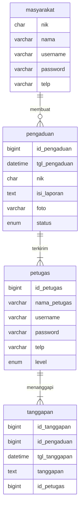
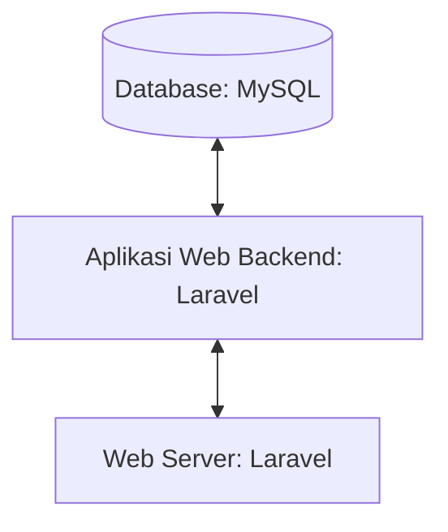

# 1.1 Latar Belakang
aplikasi pelaporan pengaduan masyarakat adalah untuk meningkatkan kualitas pelayanan publik dan membangun partisipasi masyarakat dalam memperbaiki kinerja instansi pemerintah Pengaduan masyarakat merupakan bagian terpenting pada instansi pemerintahan karena pengaduan masyarakat bertujuan untuk membangun kesejahteraan dan memperbaiki kekurangan dari kegiatan yang sudah terlaksanakan Namun, masih banyak permasalahan dalam hal pengaduan, seperti belum adanya wadah untuk pengaduan, masyarakat masih sulit berinteraksi dengan pemerintah desa, belum ada digitalisasi dalam pengaduan, aspirasi dari masyarakat banyak yang antri dan tidak tahu kapan jawabannya, serta perekapan data aduan bagi pemerintah desa masih pemberkasan manual Oleh karena itu, dibutuhkan adanya sistem informasi pengaduan sosial sebagai wadah untuk mempermudah masyarakat dalam melakukan pengaduan masalah yang terjadi di lingkungan masyarakat
# 1.2 Deskripsi
Aplikasi ini bertujuan untuk masyarakat apabila mereka ada keluhan atau sejenisnya di desa atau di derah mereka sehingga biar tidak usah ke desanya langsung tapi lewat aplikasi pelaporan masyarakat ini 
# 1.3 Branding
- merk : Pekat (pengaduan masyarakat)
- Tagline : "ada masalah di desa anda? laporkan saja disini"
- campaign : Tempat untuk menyimpan keluhan atau saran dan inspirasi untuk kemajuan desa tersebut
- Target user :
   - umur 15+
   - orang yang ingin melaporkan masalah atau pengaduan terkait dengan layanan publik, keamanan, lingkungan, atau masalah lainnya.
- User experience theme:
   - sederhana
   - warna : dominan warna ungu dan warna putih

# 2. User Story

sebagai | saya ingin bisa | sehingga | prioritas
---|---|---|---
masyarakat | membuat laporan pengaduan | bisa kejadian/keadaan di desanya | ⭐⭐⭐⭐⭐
masyarakat | melihat laporan yang saya buat | bisa mengingat laporan yang saya buat | ⭐⭐⭐⭐
# 3. Struktur Data

## 4 Arsitektur Sistem

# 5. Teknologi, Library, dan Framework

Untuk teknologi saya menggunakan Visual Studio Code Sedangkan dalam pemrograman saya menggunakan Framework Laravel
# 6. Desain User Experience dan User Interface

## Design UI & UX Menggunakan Figma
### Link Figma
> https://www.figma.com/file/yq2L28KRVuFQePBRRs0U4i/pekat?type=design&node-id=0%3A1&mode=design&t=HHtm69bUVSGFYLqu-1
- **Landing Page**
- 
- **Halaman Login Petugas**
- 
- ** Halaman Daftar**
- 
## 7. Demonstrasi Video

Link youtube nya

## 8. Bagaimana mesin komputasi dan sistem operasi berperan dalam produk teknologi informasimu ?

Link youtube nya di detik jawaban ini

## 9. Bagaimana algoritma, struktur data, dan bahasa pemrograman berperan dalam produk teknologi informasimu ?

Link youtube nya di detik jawaban ini

## 10. Bagaimana metode pengembangan perangkat lunak / Software Development Life Cycle berperan dalam produk teknologi informasimu ?

Link youtube nya di detik jawaban ini

## 11. Bagaimana database / sistem basis data berperan dalam produk teknologi informasimu ?

Link youtube nya di detik jawaban ini

